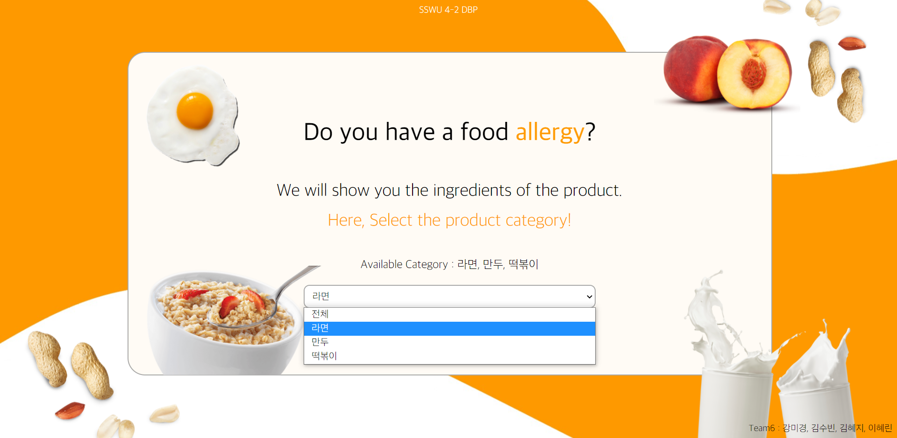
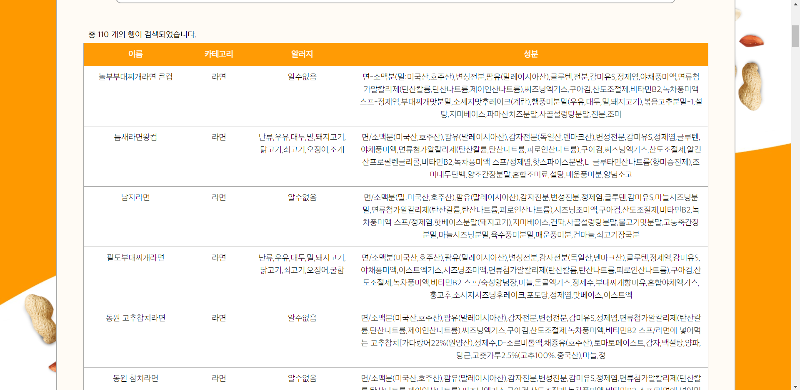
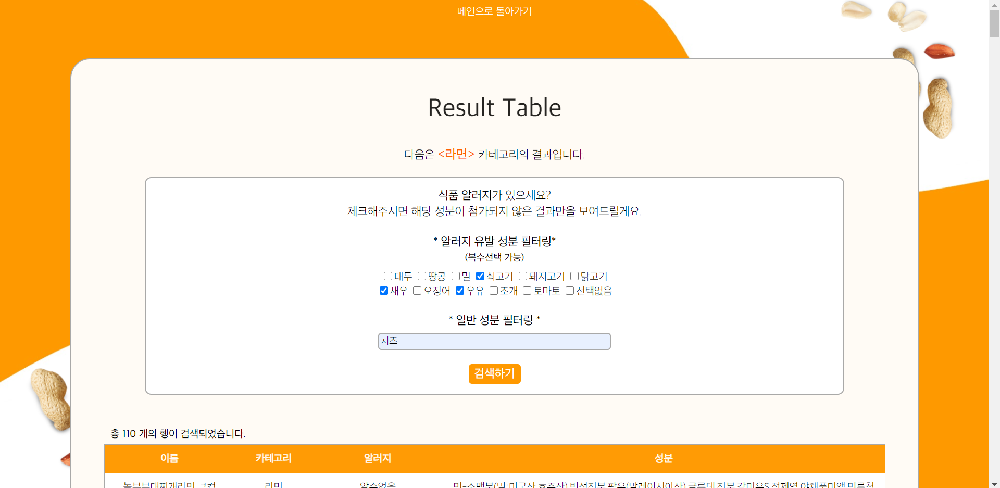
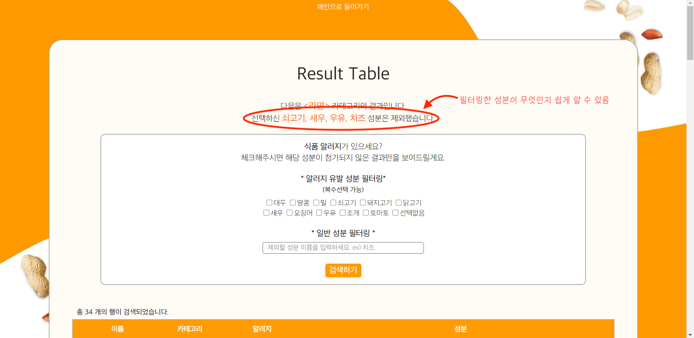
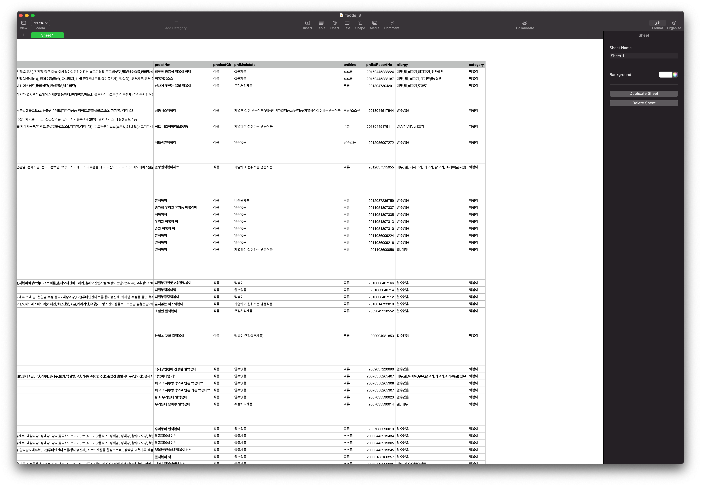
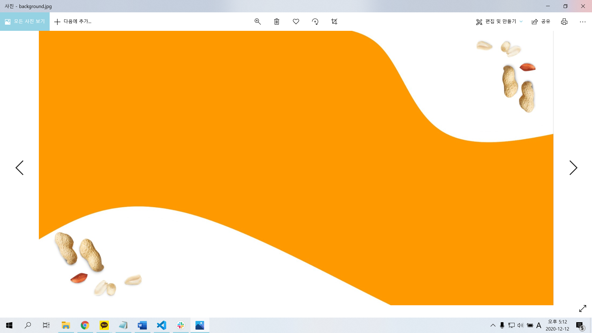

# dbp-t06: 🍑🥛🥜Aller-joyo(알러조요)🥜🥛🍑
* 아래 이미지를 클릭하면 홈페이지로 링크됨.

## 🍑 기획 배경 및 목적
### 🥛 기획 배경
* 알러지 유발 성분 표기가 미비한 식품들이 많음을 알게됨.

### 🥛 기획 목적
* 알러지 유발 성분 표기가 미비한 식품들 안전하게 섭취할 수 있도록 알러지 유발 성분을 검색하여 필터링 할 수 있는 서비스를 제공하고자 함.

## 🍑 Aller-joyo 서비스 소개
### 🥛 서비스 개요
* Allergy + 알려줘요
* 다양한 떡볶이, 라면, 만두 카테고리에 속하는 공산품의 전성분 중 사용자가 선택한 식품 성분을 필터링해주는 서비스임.
* 사용자는 개인의 체질, 기호, 신념 등에 맞지 않는 전성분을 선택 또는 입력하여 섭취 가능한 식품을 확인할 수 있음.

### 🥛 서비스 상세
#### 🥜 메인 화면
* 메인 화면인 index.php는 아래 이미지와 같음.

* 메인화면에서 사용자는 검색할 식품의 카테고리를 드롭다운 메뉴에서 선택할 수 있음. 현재 가능한 카테고리는 라면, 만두, 떡볶이 세 가지임. 카테고리를 분류하지 않고 싶다면 '전체'를 선택하면 됨.

#### 🥜 카테고리 선택 결과
* '라면' 카테고리를 선택한 결과는 다음과 같음.
* 상단에는 알러지 유발 성분을 필터링 할 수 있는 메뉴가 나옴. 안내 문구로 어떤 카테고리를 선택하였는지 쉽게 알 수 있음.

* 성분 필터링 메뉴 밑에 테이블로 '라면' 카테고리에 해당하는 제품들이 보여짐.

### 🥜 알러지 유발 성분 및 일반 성분 필터링
* 사용자는 거르고 싶은 알러지 유발 성분과 일반 성분을 선택 및 입력한 후 검색하기 버튼을 누름.

* 필터링한 성분에 대한 결과를 확인할 수 있음. 어떤 성분을 필터링하였는지는 상단의 안내 문구로 쉽게 확인할 수 있음.

## 🍑 개발 환경 및 언어
### 🥛 개발 환경
* Apache, MySQL
### 🥛 개발 언어
* PHP, HTML, CSS

## 🍑 개발 과정
### 🥛 데이터 수집 과정
1. 수집할 데이터 선택
* 공공데이터포털에서 활용하고자 하는 API 개발 활용 신청 후 인증키 발급받음.
2. 데이터 생성
* 해당 API에 쿼리를 던져 JSON 형태로 리스펀스 받음.

* JSON 데이터에서 필요한 부분만 뽑아냄.
* JSON 데이터를 CSV 파일로 변환함.
  * [온라인 JSON to CSV converter](http://convertcsv.com/json-to-csv.htm)를 사용함.
* Numbers를 이용하여 Aller-joyo에 필요한 'category' 컬럼을 추가하고 값 추가함.

* 완성된 데이터를 CSV 파일로 export함.
--------------------------------------
### 🥛 프론트엔드 개발 과정
1. 참조할 디자인 셀렉  
* 프로젝트의 컨셉에 따라 음식과 관련된 디자인을 선택한 후 색 코드를 정리함.

2. 디자인 초안 만들기  
* 포토샵을 할 줄 몰라 그림판을 이용함(포토샵의 중요성을 알게 되었음.). 디자인 프레임을 생성한 후에 이미지, 문구, 폰트 등의 디테일은 웹 페이지의 컨셉에 맞게 디자인하여 초안 완성함.

3. 웹에서 구현하기  
* 최소한의 디자인만 포함한 이미지를 웹의 background로 삽입한 이후에 나머지는 HTML, CSS 바탕으로 구현함. 이미지와 요소들은 주로 `position:absolute`를 이용해 배치시킴.

--------------------------------------
### 🥛 백엔드 개발 과정

## 🍑 역할 분담
* 20160965 통계학과 강미경: 프론트엔드, 백엔드, 프론트엔드 & 백엔드 병합
* 20172025 컴퓨터공학과 김수빈: 백엔드, 백엔드 코드 병합
* 20172081 컴퓨터공학과 이혜린: 백엔드, 서버에 올리기
* 20180978 컴퓨터공학과 김혜지: 데이터 수집 & 생성, 백엔드, README 작성

## 🍑 출처
* 데이터 수집
  * [공공데이터 포털](https://data.go.kr/tcs/dss/selectApiDataDetailView.do?publicDataPk=15033303)
* 프론트 엔드
  * [디자인 참고](https://www.behance.net/gallery/105457801/Website-for-peanut-paste-shop-Landing-page?tracking_source=search_projects_appreciations%7Cfood)
  * [이미지](http://pngimg.com)
  * [폰트](http://blog.naver.com/PostView.nhn?blogId=yangwonder&logNo=221934305968&categoryNo=0&parentCategoryNo=34&viewDate=&currentPage=1&postListTopCurrentPage=1&from=search)
